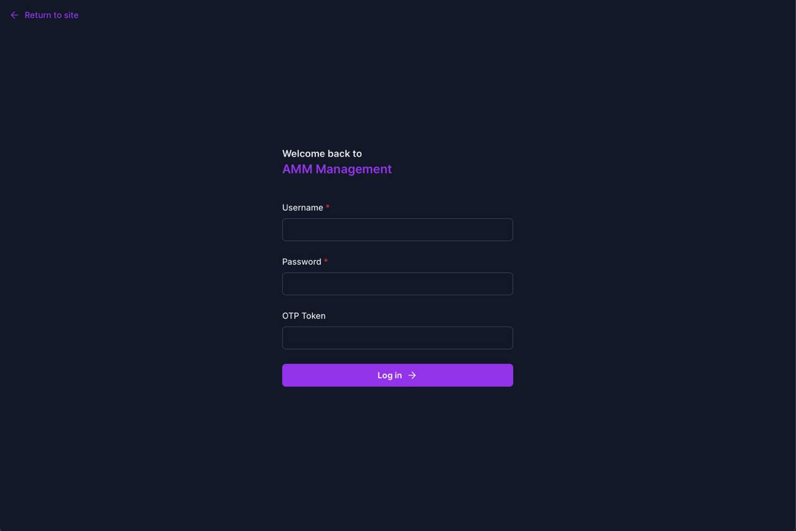
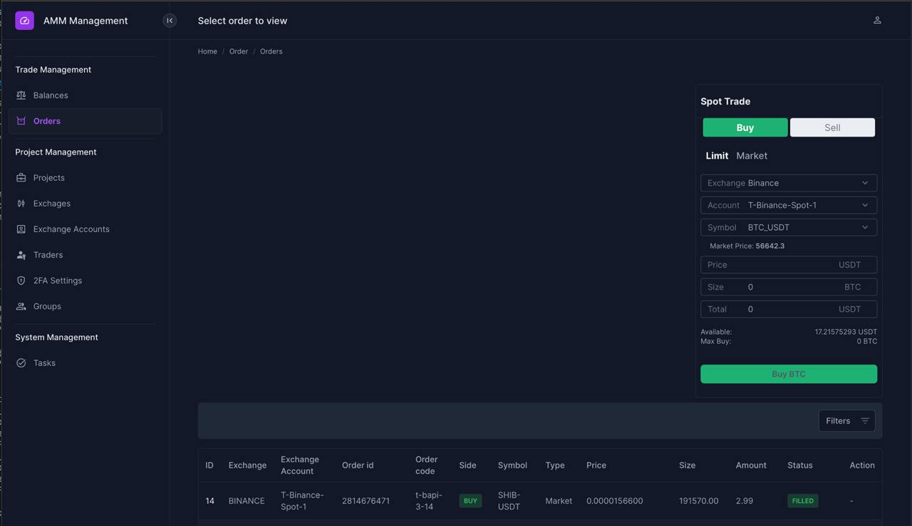

# Trade

## Overview
Trade is a personal experimental project that provides a management backend for cryptocurrency exchange accounts. It enables trading operations like spot, futures, and options trading through exchange APIs. Currently, spot trading and account trade data synchronization have been implemented. Support for futures, options trading, and public market data storage will be added in future updates.

## Supported Exchanges
- [x] Binance
- [x] Bybit
- [x] OKX
- [x] Gate.io
- [x] Kucoin
- [x] Mexc

## Project Structure
The project is built with:
- Backend: Django Rest Framework for RESTful API services
- Task Management: Celery for scheduled and asynchronous tasks
- Frontend: unfold + Alpine.js + Tailwindcss
- Deployment: Docker Compose

## Preview

